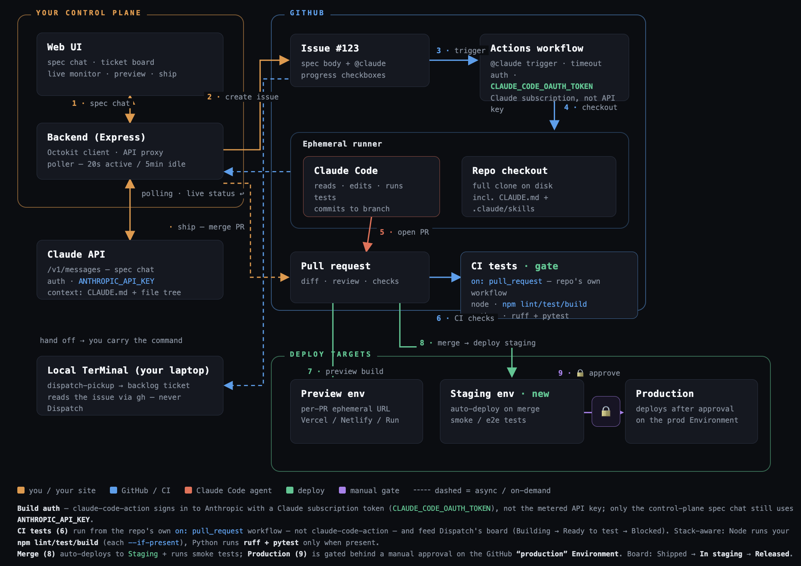

# Dispatch

**A structured web UI wrapping GitHub/GitLab as the source of truth: chat →
AI-drafted ticket → poller-computed kanban.** Describe a feature or bug in a
chat UI, file it as an issue with one click, and `claude-code-action` builds
it on a runner and opens a PR. A poller turns issue/PR/check state into a live
board — spec → queued → building → ready to test → shipped — optionally
mirrored to a Slack channel, so you can test the preview and ship to
production without leaving one browser tab (or Slack). Dispatch
stores almost nothing itself: delete the local SQLite cache and it rebuilds
the whole board from the provider on the next poll.



- **Frontend:** React 18 + Vite + Tailwind v3 (dark), `http://localhost:5173`
- **Backend:** Express on Node 20, `http://127.0.0.1:3001` (localhost-only)
- **Storage:** SQLite (`./data/dispatch.db`) — disposable cache; deletable
- **Providers:** GitHub (Octokit) and GitLab (gitbeaker), behind one adapter seam


## How it works

1. **Repos** — Dispatch lists every repo your token(s) can access; click
   **Track** (zero typing) or paste a path/URL. Tracked repos cache their
   description, `CLAUDE.md`, README excerpt, and a depth-2 file tree (refreshed
   on demand, ≤6h).
2. **Spec chat** — converse with Claude (scoped to a repo, context injected) to
   refine an issue spec, then **Generate ticket** → edit → **File ticket**.
3. **Board** — six columns derived from provider state: Spec, Queued, Building,
   Ready to test, Shipped, Blocked. A poller reconciles every 20s (active) /
   5min (idle); columns, PR linkage, and checks are derived, never stored.
4. **Test** — open the PR preview and per-check statuses from the card; **Steer**
   by commenting `@claude` to re-trigger the build.
5. **Ship** — one-click merge (gated on green + mergeable), confirmation modal,
   then the issue auto-closes and the card reaches Shipped.


## Quick start (local dev)

```bash
cp .env.example .env     # fill in the keys below
npm install
npm run dev              # starts backend (:3001) + Vite (:5173) together
```

Open `http://localhost:5173`. With a valid `.env` you'll get an empty board and a
working health check (footer shows DB + rate-limit status).

This runs Dispatch as a single local process with no auth — fine for one
operator on `localhost`. To deploy it for real (authenticated, on Cloud Run),
see [`DEPLOY.md`](DEPLOY.md).

## Environment (`.env`, gitignored)

| Key | Required | Purpose |
|---|---|---|
| `ANTHROPIC_API_KEY` | for spec chat | Anthropic Messages API (spec refinement + ticket JSON) |
| `ANTHROPIC_MODEL` | optional | Override the model (default `claude-sonnet-4-6`) |
| `DISPATCH_DAILY_BUDGET_USD` | optional | Cap Anthropic spend per UTC day. Unset = no cap. Once the day's spend reaches the cap, chat and ticket generation return `429` until 00:00 UTC. Requires `ANTHROPIC_MODEL` to be priced in `server/anthropic/pricing.ts`. |
| `GITHUB_TOKEN` | for GitHub repos | Fine-grained PAT ([permissions](#1-token)) |
| `GITLAB_TOKEN` | for GitLab repos | PAT with `api` scope |
| `GITLAB_HOST` | self-hosted GitLab | Base URL (defaults to `https://gitlab.com`) |
| `PORT` | optional | Backend port (default 3001) |
| `HOST` / `ALLOW_NONLOCAL` | optional | Bind host; non-local requires `ALLOW_NONLOCAL=1` |
| `DISPATCH_PASSWORD` | optional | Shared-password gate (HTTP Basic Auth) for internet-reachable deploys |
| `SLACK_WEBHOOK_URL` | optional | Slack [Incoming Webhook](https://api.slack.com/messaging/webhooks); mirrors the activity feed into a channel |

Keys are loaded server-side only, never sent to the browser, and redacted from
logs and error messages.

### Slack notifications

Set `SLACK_WEBHOOK_URL` to a Slack Incoming Webhook and Dispatch posts each
activity event (issue filed, column changes, PR opened, steered, merged, skill
runs) to that webhook's channel. Create one at
<https://api.slack.com/messaging/webhooks> (new app → **Incoming Webhooks** →
add to a channel). It's one-way and best-effort — a Slack outage never blocks
Dispatch. Any existing `hooks.slack.com/services/…` webhook works; reusing one
just routes notifications to that same channel.

## Connecting a repo

Four steps: give Dispatch a **token**, **track** the repo, enable the **build
loop** on it, and (optionally) wire **preview deploys** so you can test a PR
before shipping. Longer walkthrough with the workflow YAML details:
[`docs/adding-a-repo.md`](docs/adding-a-repo.md).

### 1. Token

Tokens are resolved lazily, per provider — a GitHub-only setup never needs
`GITLAB_TOKEN`, and vice versa (`server/providers/index.ts`).

**GitHub** — a [fine-grained PAT](https://github.com/settings/personal-access-tokens/new)
scoped to the repos you'll track:

| Permission | Why |
|---|---|
| Metadata: **read** | required by GitHub for any fine-grained PAT |
| Contents: **read** | `CLAUDE.md`, README excerpt, depth-2 file tree |
| Issues: **read & write** | file tickets, comment `@claude`, apply the `dispatch` label |
| Pull requests: **read & write** | board state, diffs, and the one-click merge |
| Actions: **read** | workflow runs — how the board sees *Building* |
| Commit statuses: **read** | CI check state and most preview URLs |
| Deployments: **read** | preview URLs from deployment statuses (optional) |

GitHub does not offer **Checks** to fine-grained PATs at all; Dispatch expects
the `403` and falls back to commit statuses plus the workflow-run signal, so the
board still works. Deployments and commit-statuses `403`s degrade to "no preview
URL" rather than failing the poll. A classic PAT with `repo` also works and
grants considerably more than the above. Set it as `GITHUB_TOKEN`.

**GitLab** — a PAT with the `api` scope → `GITLAB_TOKEN`. For a self-hosted
instance also set `GITLAB_HOST` (used as the default base URL; a repo tracked by
full URL carries its own host).

### 2. Track the repo

Open **Repos** in the UI:

- **Discover** lists everything the token can reach (`GET /user/repos` by most
  recently pushed on GitHub; projects you're a member of on GitLab). Click
  **Track**.
- **Add manually** takes a bare `owner/name` (assumed GitHub) or a full URL:
  `github.com` → GitHub, `gitlab.com` → GitLab, and **any other host → treated as
  self-hosted GitLab**, with that origin stored as the repo's host.

Tracking fetches repo context first, so a bad token or a repo the token can't
see fails before anything is saved. On success Dispatch caches the description,
`CLAUDE.md`, README excerpt, and file tree, then imports the repo's existing open
issues onto the board.

### 3. Enable the build loop

An `@claude` mention only builds something if `claude-code-action` is installed
on the repo. Either run `/install-github-app` from Claude Code inside a clone, or
use the API-only installer:

```bash
GH_SETUP_TOKEN=github_pat_xxx ./scripts/install-claude-action.sh <owner>/<repo>
```

The setup token needs **Contents, Workflows, and Secrets: write** — deliberately
more than the Dispatch token above, which is `Contents: read`. Both paths are
compared in [`docs/adding-a-repo.md`](docs/adding-a-repo.md).

Until one is in place the repo card shows **⚠ No Claude automation detected**.
That flag is a content check, not a guess: on GitHub a workflow file under
`.github/workflows/` whose *name* mentions claude, or whose body contains
`claude-code-action`, `anthropics/claude`, or `@claude`; on GitLab a
`.gitlab-ci.yml` mentioning `claude` or `anthropics`. Click **Refresh context**
after installing to clear it.

### 4. Preview deploys (Vercel, Netlify, Render, …)

Dispatch **never creates environments** — it reads what your deploy provider
already reports against the PR's head commit, in this order:

1. a **commit status** whose context matches
   `vercel|netlify|preview|deploy|render|surge|pages` and carries a target URL;
2. otherwise the newest **deployment status**' `environment_url` (or `target_url`).

So for Vercel the entire setup is *connect Vercel to the GitHub repo the way you
normally would*. Dispatch stores no Vercel token and calls no Vercel API; the
**Preview ↗** button on the card picks the URL up from GitHub on the next poll.
Netlify, Render, Cloudflare Pages and anything else that posts a deployment
status work the same way.

**Fallback pattern.** When no live URL is reported you can give the repo a URL
template, where `{n}` is substituted with the PR number. It isn't exposed in the
Track UI yet — set it through the API (`merge_method` is `squash` | `merge` |
`rebase`, defaulting to `squash`, and is what **Ship** uses):

```bash
curl -X POST http://127.0.0.1:3001/api/repos \
  -H 'content-type: application/json' \
  -d '{"path":"acme/widgets",
       "preview_url_pattern":"https://widgets-pr-{n}.vercel.app",
       "merge_method":"squash"}'
```

A live URL always wins over the pattern; when the pattern is used the button
reads **Preview ↗ (pattern)** so you know it's a guess. GitLab MRs never report a
live URL today, so the pattern is the only preview there.

### GitLab repos (integration is beta)

> Verify current docs at code.claude.com/docs/en/gitlab-ci-cd.

Add the Claude job to `.gitlab-ci.yml` per the official setup, with
`ANTHROPIC_API_KEY` stored as a masked CI/CD variable. `@claude` mentions in
issues and MR threads trigger the job, which commits results back via MRs.


## Scripts

| Command | What it does |
|---|---|
| `npm run dev` | Backend + Vite together |
| `npm run typecheck` | Type-check server and web |
| `npm run check:seam` | Assert no provider SDK imports outside `server/providers/` |
| `npm run verify` | typecheck + seam guard |

## Rebuild rule

The Git provider is the source of truth. Deleting `data/dispatch.db` and
restarting rebuilds all non-draft cards from the provider on the first poll —
only local drafts (unsent spec chats) are lost.
